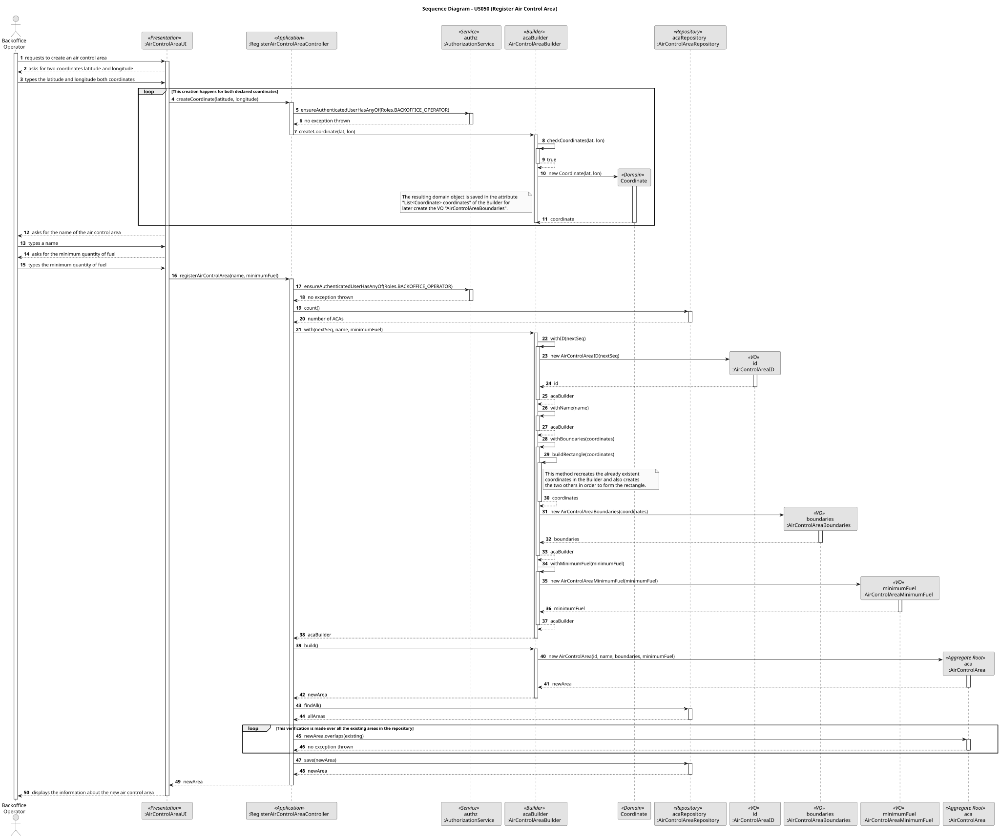
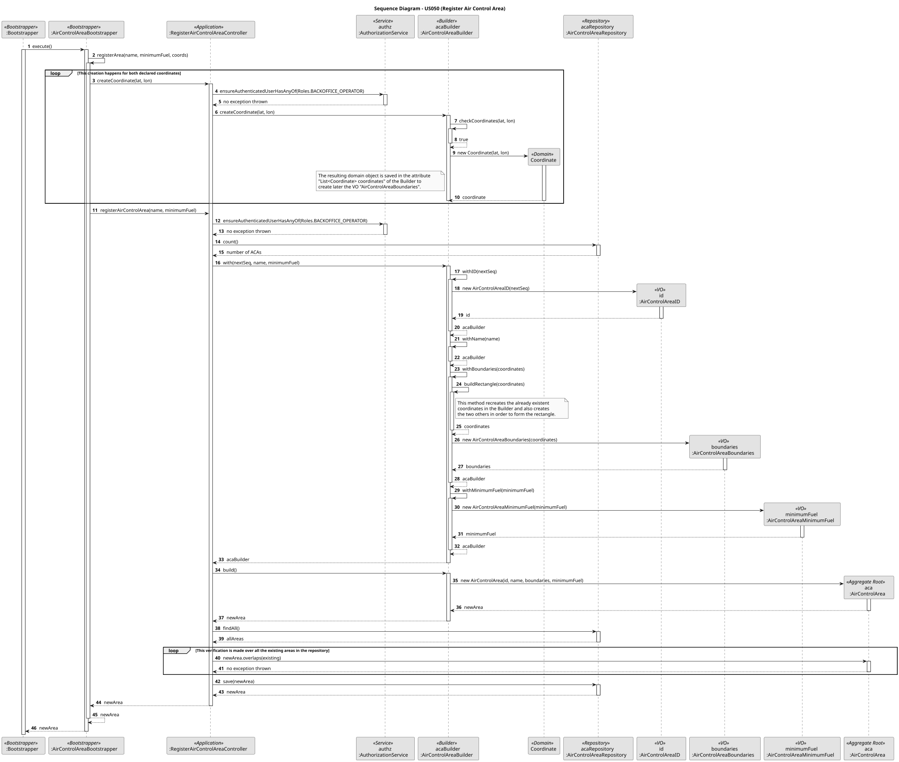

# US050 – Register an air control area

## 1. Context

As a Backoffice Operator, one of the core activities is to register an air control area in the system, to organize the air traffic and create a more efficient and tangible way to manage it. Also, the air control areas are a key part of the management of flight operations and security,
acting as the entity that defines the operational patterns inside its geographic jurisdiction.

### 1.1 List of issues

#### Analysis:

1. **_"What are the key functionalities of the air control area?"_**
  - It acts as a subdivision of the air traffic, containing airports associated with it, having its own operational rules, geographic boundaries and minimum amount of fuel required once an aircraft lands on an airport in it.
2. **_"What are the attributes that define an air control area?"_** 
  - ID, area name, geographic boundaries and minimum amount of fuel when landing.
3. **_"How are the geographic boundaries of the air control area defined?"_**
  - An air control area is always a rectangle. The user will input two coordinates, with them being the vertices of the rectangle's main diagonal.
4. **_"Can the air control areas overlap?"_**
  - No, since they are subdivisions of the air traffic, and they have their own operational rules, they should not overlap since it would be a much more complex situation to manage.
5. **_"Which restrictions should be implemented to the creation of an air control area?"_**
  - The coordinates of an air control area should not be all at the same latitude/longitude, otherwise it would create a straight line.

#### Design:

- Design of the domain class `AirControlArea` as the aggregate root, having three embedded Value Objects: `AirControlAreaID`, `AirControlAreaBoundaries` and `AirControlAreaMinimumFuel`. The area name will be a unique String identifier.

*Observation: the `AirControlAreaBoundaries` will be a Value Object that uses the existing `Coordinate` value object to define its location and extent.*

- Design of the bootstrapper class `AirControlAreaBootstrapper` that handles the registration of the air control area through a bootstrap process.
- Design of the UI for this use case: `RegisterAirControlAreaUI`, that handles the manual registration of an air control area by the request of user inputs.
- Design of the Controller for this use case: `RegisterAirControlAreaController`, that handles the request from both the UI and the bootstrapper and delegates it to the other layers.
- Design of the Builder class `AirControlAreaBuilder` that builds the domain object.
- Design of the repository interface `AirControlAreaRepository` that abstracts the persistence layer, with the implementations `InMemoryAirControlAreaRepository` and `JpaAirControlAreaRepository`.

#### Implement:

- Bootstrapper: `AirControlAreaBootstrapper`
- UI: `RegisterAirControlAreaUI`
- Application: `RegisterAirControlAreaController`
- Domain: `AirControlArea`, `AirControlAreaID`, `AirControlAreaBoundaries` and `AirControlAreaMinimumFuel`.
- Builder: `AirControlAreaBuilder`
- Persistence: `AirControlAreaRepository`, `InMemoryAirControlAreaRepository` and `JpaAirControlAreaRepository`.

#### Test:

- Unit tests for all the domain and controller classes involved in the air control area registration process.
- Manual verification of the UI and bootstrap process.

## 2. Requirements

**US050** As a Backoffice Operator, I want to register an air control area. The area code must be unique in the system. Geographic boundaries must be valid. This must also be achievable by a bootstrap process.

**Acceptance Criteria:**

- An air control area is registered with a unique area code in the system (automatically generated).
- The system must validate the geographic boundaries of the air control area to see if it overlaps other areas or makes sense to create a rectangle.
- The air control area registration must be done manually (via UI) and via a bootstrap process.
- The air control area must define a minimum amount of fuel for an aircraft to land in it.

**Dependencies/References:**

US050 depends on US030, for the authentication and authorization of the backoffice users.

## 3. Analysis

The registration of an air control area involves several key considerations:

1.  **Air Control Area Identity**: Each air control area must be uniquely identified by an automatically generated ID (`AirControlAreaID`) and a unique area name.
2.  **Geographic Boundaries**: The area has geographic jurisdiction. These boundaries must be valid and are represented by `AirControlAreaBoundaries`, which uses the existing `Coordinate` value object to define its extent.
3.  **Operational Rules**: A critical attribute is the `AirControlAreaMinimumFuel`, which specifies the minimum amount of fuel an aircraft must have while landing at any airport within this area.
4.  **Security**: Registration is performed by a `Backoffice Operator`. Access control must ensure only authorized users can perform this operation.
5.  **Bootstrap Process**: The system must support registering some areas automatically during startup to ensure initial data availability.
6.  **Persistence**: Registered air control areas must be persisted in a repository for later retrieval and association with other entities like airports.

## 4. Design

The design follows the onion architecture, ensuring a clear separation of concerns:

- **Presentation Layer**: `RegisterAirControlAreaUI` handles user interaction, gathering the area name, boundaries and minimum fuel requirements.
- **Application Layer**: `RegisterAirControlAreaController` coordinates the use case.
- **Domain Layer**: 
    - `AirControlArea` is the Aggregate Root.
    - `AirControlAreaID`, `AirControlAreaBoundaries`, and `AirControlAreaMinimumFuel` are Value Objects encapsulating domain logic and validation.
    - `AirControlAreaBuilder` simplifies the creation of the `AirControlArea` aggregate.
- **Infrastructure Layer**: 
    - `AirControlAreaRepository` (interface) and its implementations (`JpaAirControlAreaRepository`, `InMemoryAirControlAreaRepository`) handle persistence.
    - `AirControlAreaBootstrapper` enables automatic registration during system startup.

### 4.1. Realization

### 4.2. Acceptance Tests

**Unit Tests**
- **Action:** Test the domain classes involved in the air control area registration process, such as `AirControlArea` and its embedded Value Objects and `RegisterAirControlAreaController`.
- **Expected Result:** All classes should pass their respective unit tests.

**Manual Test 1: Register Air Control Area via UI**
- **Action:** Log in as a Backoffice Operator, navigate to air control area management, and register a new air control area.
- **Expected Result:** Success message displayed, and the new air control area is now registered in the system.

**Manual Test 2: Same Geographic Boundaries**
- **Action:** Attempt to register a new air control area with the same/overlaping geographic boundaries as an existing one.
- **Expected Result:** Error message indicating that the geographic boundaries are already in use/overlaps other areas.

**Manual Test 3: Same Area Name**
- **Action:** Attempt to register a new air control area with the same name as an existing one.
- **Expected Result:** Error message indicating that the inserted name is already in use.

## 5. Implementation

### Key Classes

1. `RegisterAirControlAreaUI` : user interface for the air control area registration process in case of a manual registration.
2. `RegisterAirControlAreaController` : controller to coordinate the air control area registration process flow.
3. `AirControlArea`, `AirControlAreaID`, `AirControlAreaBoundaries` and `AirControlAreaMinimumFuel` : domain classes involved in the air control area registration process.
4. `AirControlAreaBuilder` : builder class for the air control area domain object.
5. `AirControlAreaRepository`, `InMemoryAirControlAreaRepository` and `JpaAirControlAreaRepository` : persistence layer for the air control area domain object.
6. `AirControlAreaBootstrapper` : bootstrapper class for the air control area registration process.

## 6. Integration/Demonstration

To demonstrate the functionality:

1. Build the project (`build.bat` or `build.sh`)
2. Run the bootstrap process (usually via `run-bootstrap.bat` or `run-bootstrap.sh`).
3. Run the backoffice application (`run-backoffice.bat` or `run-backoffice.sh`).
4. Log in with backoffice operator credentials (or create a new one) and navigate to the air control area management page.
5. Use the UI to register a new air control area.
6. Input the required data.
7. Read the success message or check the new air control area's existence in the database.

## 7. Observations

- As it makes much more sense, it was assumed that air control areas could not overlap, since the project assignment is clear that they are subdivisions of the air traffic, and they have a uniqueness logic, since each air control area has its own rules and operational patterns for the flights that fly over it.
- It was also defined as a system model decision that the geographic boundaries of the air control area would be a polygon with at least three vertices and a maximum of five, just like the rules for the creation of an air control area described in the analysis section.
