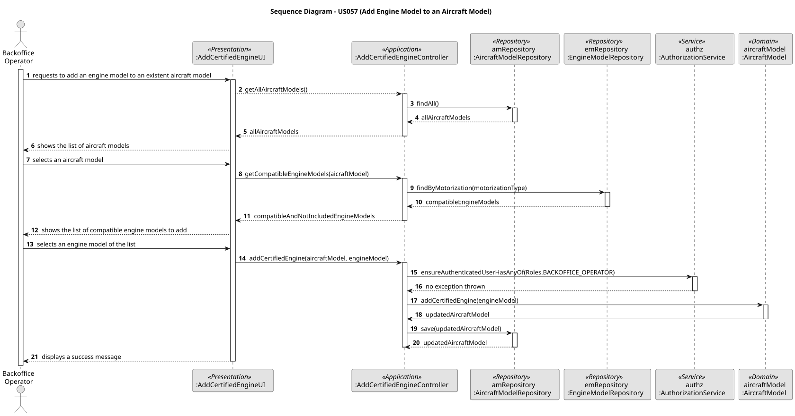

# US057 – Add an engine model to an aircraft model

## 1. Context

The addition of an engine model to the certified engines list of an aircraft model is one of the most important responsibilities of a Backoffice Operator. An aircraft model can support several different engine models.

### 1.1 List of issues

#### Analysis:

1. **_"Which restrictions should be considered to the addition of an engine model to an aircraft model?"_**
- An engine model can only be added once to the engines list of an aircraft model. Also, the engine model motorization type must be compatible with the aircraft model's.

#### Design:

- Design of the method `addCertifiedEngine` in the domain class `AircraftModel`.
- Design of the method `findByMotorization` in the repository class `EngineModelRepository`, that will be used to find a list of engine models with a specific motorization type.
- Design of the UI for this use case: `AddCertifiedEngineUI`, that handles the user interaction for this functionality.
- Design of the Controller for this use case: `AddCertifiedEngineController`, that coordinates the application flow of the use case.
- Change of the US055 and US056 classes to apprioriately follow the US057 requirements.

#### Implement:

- Method: `addCertifiedEngine` (inside the domain class `AircraftModel`)
- Method: `findByMotorization` (inside the repository classes of `EngineModelRepository`)
- UI: `AddCertifiedEngineUI`
- Controller: `AddCertifiedEngineController`

#### Test:

- Unit tests for the new domain method and the Controller class involved in the engine model addition process.
- Manual verification of the use case.

## 2. Requirements

**US057** As a Backoffice Operator, I want to add an engine model to an aircraft model’s list of certified engines. Engine type must be compatible. The same engine model cannot be added twice to the same aircraft. An aircraft model might have several aircraft variants (combinations of model and engine configuration).

**Acceptance Criteria:**

- The engine model motorization type must be compatible with the aircraft model's.
- An engine model can only be added once to the engines list of an aircraft model.
- The aircraft model must be registered in the system before adding an engine model to it.
- There can be several aircraft variants (combinations of model and engine configuration) for the same aircraft model.

**Dependencies/References:**

US057 depends mainly on two User Stories: US055 ("Create an aircraft model") and US056 ("Create an aircraft engine model"), because it needs the domain classes and logic implemented on those to be done. Beyond that, US057 depends on US030, for the authentication and authorization of the backoffice users.

## 3. Analysis

1. **Uniqueness**: The engine model must be unique within the aircraft model's list of certified engines.
2. **Compatibility**: To add an engine model to an aircraft model, the motorization type of both should be the same. Otherwise, the system denies the addition.

## 4. Design

- **Presentation Layer**: `AddCertifiedEngineUI` handles user interaction.
- **Application Layer**: `AddCertifiedEngineController` coordinates the use case.
- **Domain Layer**:
    - `addCertifiedEngine` will be the method responsible for adding an engine model to an aircraft model's list of certified engines. 
- **Persistence Layer**:
    - `findByMotorization` will be the method responsible for finding a list of engine models with a specific motorization type inside the class `EngineModelRepository`. This will be of major importance for the invariant that the engine model motorization type must be compatible with the aircraft model's.

Other changes in the classes implemented in US055 and US056 will be:

- Insertion of the attribute `motorization` in the class `AircraftModel`;
- Inclusion of this attribute in all the classes that request the creation of an aircraft model (`AircraftModelBootstrapper`, UI and Controller classes).
- Change of the constructor method of the class `AircraftModel` for it to call the method `addCertifiedEngine`, to validate each engine model in the list and follow the business rules.
- Creation of a toString() method for the class `Maker`.
- Make the class `EngineModel` implement equals() to check if two entitites are the same.

### 4.1. Realization

### 4.2. Acceptance Tests

**Unit Tests**
- **Action:** Test the method and the Controller class involved in the engine model addition process: `addCertifiedEngine` and `AddCertifiedEngineController`.
- **Expected Result:** All unit tests must pass.

**Manual Test 1: Add an Engine Model to an Aicraft Model via UI**
- **Action:** Log in as a Backoffice Operator, navigate to the aircraft model management menu, and add an engine model to an existent aircraft model.
- **Expected Result:** Success message displayed, and the engine model is now registered in the aircraft model's engine list.

**Manual Test 2: Try to add an Engine Model to an Aircraft Model Twice**
- **Action:** Add an engine model to an aircraft model via UI and then try to add the same engine model again.
- **Expected Result:** The UI won't show the engine models that are already registered in the aircraft model's engine list.

## 5. Implementation

### Key Methods

1. `addCertifiedEngine` : adds a new engine model to the certified engines list of an aircraft model.

### Key Classes

1. `AddCertifiedEngineUI` : user interface for the engine model addition.
2. `AddCertifiedEngineController` : controller to coordinate the engine model addition process flow.

## 6. Integration/Demonstration

To demonstrate the functionality:

1. Build the project (`build.bat` or `build.sh`)
2. Run the backoffice application (`run-backoffice.bat` or `run-backoffice.sh`).
3. Log in with backoffice operator credentials (or create a new one) and navigate to the aircraft model management page.
4. Use the UI to add an engine model to an existing aircraft model.
5. Input the required data.
6. Read the success message or check the result in the database (the engine model should be registered in the aircraft model's certified engines list).

## 7. Observations

None.
