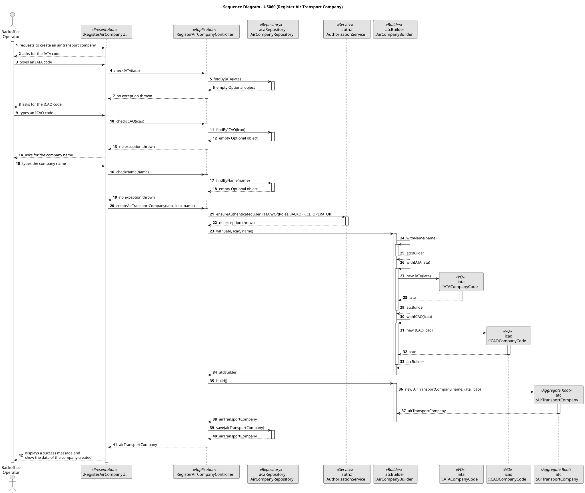
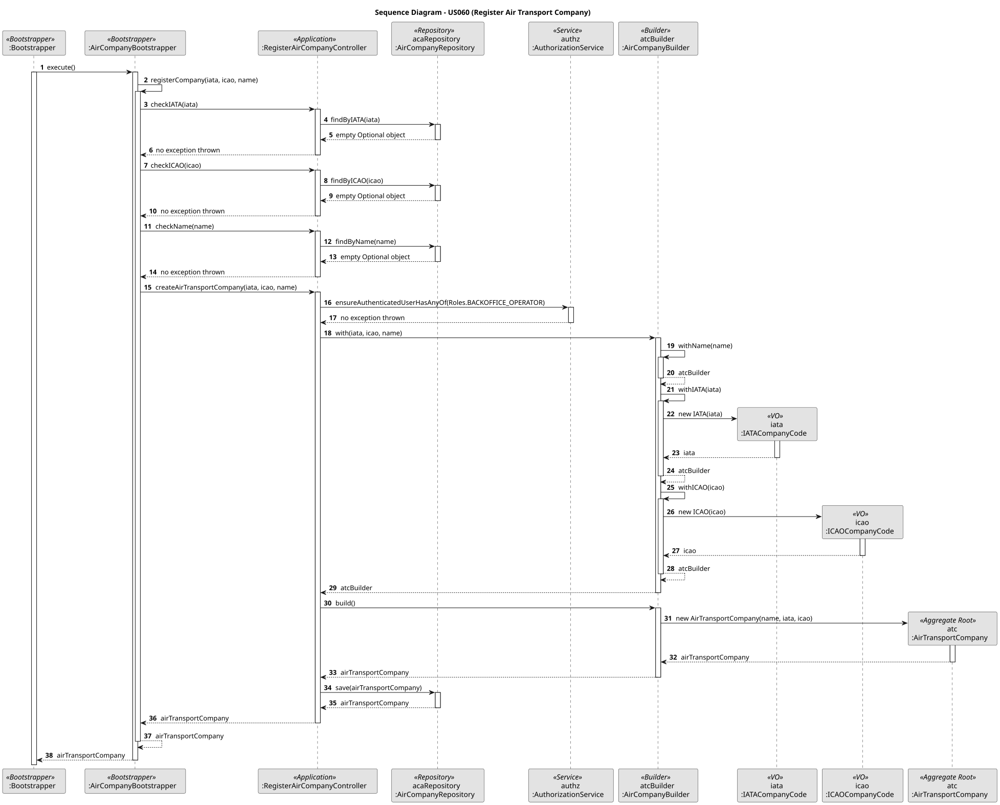

# US060 – Register an air transport company

## 1. Context

One of the main occupations of a Backoffice Operator is to register air transport companies in the system. Although they are not the direct client, the air transport companies are crucial for the AlSafe system and use it to register aircraft and flights, playing a crucial role for the whole air traffic management process to work.

### 1.1 List of issues

#### Analysis:

1. **_"What can an air transport company do in the AlSafe system?"_**
- The air transport companies are able to register flights and aircraft using the AlSafe system. They may have several collaborators (Air Transport Company Collaborators (ATCCs) and pilots) interacting with the system, and the list of these collaborators must be stored in the system. 
2. **_"What are the attributes that define an air transport company?"_**
- Name, IATA code, ICAO code (primary key), list of the collaborators and aircraft list.
3. **_"Which restrictions should be implemented to the creation of an air transport company?"_**
- The company name and IATA/ICAO codes must be unique.

#### Design:

- Design of the domain class `AirTransportCompany` as the aggregate root, having two embedded Value Objects: `IATACompanyCode` and `ICAOCompanyCode`. The company name will be a unique String identifier.
- Design of the bootstrapper class `AirCompanyBootstrapper` that handles the registration of the air transport company through a bootstrap process.
- Design of the UI for this use case: `RegisterAirCompanyUI`, that handles the manual registration of an air transport company by the request of user inputs.
- Design of the Controller for this use case: `RegisterAirCompanyController`, that handles the request from both the UI and the bootstrapper and delegates it to the other layers.
- Design of the Builder class `AirCompanyBuilder` that builds the domain object.
- Design of the repository interface `AirCompanyRepository` that abstracts the persistence layer, with the implementations `InMemoryAirCompanyRepository` and `JpaAirCompanyRepository`.

#### Implement:

- Bootstrapper: `AirCompanyBootstrapper`
- UI: `RegisterAirCompanyUI`
- Application: `RegisterAirCompanyController`
- Domain: `AirTransportCompany`, `IATACompanyCode` and `ICAOCompanyCode`.
- Builder: `AirCompanyBuilder`
- Persistence: `AirCompanyRepository`, `InMemoryAirCompanyRepository` and `JpaAirCompanyRepository`.

#### Test:

- Unit tests for all the domain and controller classes involved in the air transport company registration process.
- Manual verification of the UI and bootstrap process.

## 2. Requirements

**US060** As a Backoffice Operator, I want to register an air transport company. A company has a company name, an IATA code (two letters) and an ICAO code (two to three letters) that must be unique. This must also be achievable by a bootstrap process.

**Acceptance Criteria:**

- An air transport company must have a name, an IATA code and an ICAO code, and all of them must be unique.
- The registration process must be performed by a Backoffice Operator and also via Bootstrapper.
- The air transport company must have a list of collaborators (ATCC and pilots).
- The air transport company must be persisted in the system.

**Dependencies/References:**

US060 depends on US030, for the authentication and authorization of the backoffice users.

## 3. Analysis

The registration of an air transport company involves the following considerations:

1. **Uniqueness of attributes**: Three of the attributes of an air transport company (name, IATA and ICAO codes) are identifiers, which means that they must be unique.
2. **Collaborators**: The collaborators of an air transport company are the ATCCs and pilots. These collaborators are registered for a specific company, and they must be stored in the system.
3. **Security**: This registration is performed by a `Backoffice Operator`. Access control must ensure only authorized users can perform this operation.
4. **Bootstrap Process**: The system must support registering companies automatically during startup to ensure initial data availability.
5. **Persistence**: Registered air transport companies must be persisted in a repository for later retrieval.

## 4. Design

The design ensures a clear separation of concerns:

- **Presentation Layer**: `RegisterAirCompanyUI` handles user interaction, gathering the company name, IATA and ICAO codes.
- **Application Layer**: `RegisterAirCompanyController` coordinates the use case.
- **Domain Layer**:
    - `AirTransportCompany` is the Aggregate Root.
    - `IATACompanyCode` and `ICAOCompanyCode` are Value Objects.
    - The company name is a unique String identifier.
    - `AirCompanyBuilder` is responsible for the creation of the `AirTransportCompany` aggregate.
- **Infrastructure Layer**:
    - `AirCompanyRepository` (interface) and its implementations (`JpaAirCompanyRepository`, `InMemoryAirCompanyRepository`) handle persistence.
    - `AirCompanyBootstrapper` enables automatic registration during system startup.

### 4.1. Realization

### 4.2. Acceptance Tests

**Unit Tests**
- **Action:** Test the domain classes involved in the air transport company registration process, such as `AirTransportCompany` and its embedded Value Objects and `RegisterAirCompanyAreaController`.
- **Expected Result:** All classes should pass their respective unit tests.

**Manual Test 1: Register Air Transport Company via UI**
- **Action:** Log in as a Backoffice Operator, navigate to air transport company management, and register a new one.
- **Expected Result:** Success message displayed, and the new air transport company is now registered in the system.

**Manual Test 2: Same Name/IATA code/ICAO code**
- **Action:** Attempt to register a new air transport company with the same identifier as an existing one.
- **Expected Result:** Error message indicating that the identifier already exists in the system.

## 5. Implementation

### Key Classes

1. `RegisterAirCompanyUI` : user interface for the air transport company registration process in case of a manual registration.
2. `RegisterAirCompanyController` : controller to coordinate the air transport company registration process flow.
3. `AirTransportCompany`, `IATACompanyCode` and `ICAOCompanyCode` : domain classes involved in the air transport company registration process.
4. `AirCompanyBuilder` : builder class for the air transport company domain object.
5. `AirCompanyRepository`, `InMemoryAirCompanyRepository` and `JpaAirCompanyRepository` : persistence layer for the air transport company domain object.
6. `AirCompanyBootstrapper` : bootstrapper class for the air transport company registration process.

## 6. Integration/Demonstration

To demonstrate the functionality:

1. Build the project (`build.bat` or `build.sh`)
2. Run the bootstrap process (usually via `run-bootstrap.bat` or `run-bootstrap.sh`).
3. Run the backoffice application (`run-backoffice.bat` or `run-backoffice.sh`).
4. Log in with backoffice operator credentials (or create a new one) and navigate to the air transport company management page.
5. Use the UI to register a new air transport company.
6. Input the required data.
7. Read the success message or check the new air transport company's existence in the database.

## 7. Observations

None.
