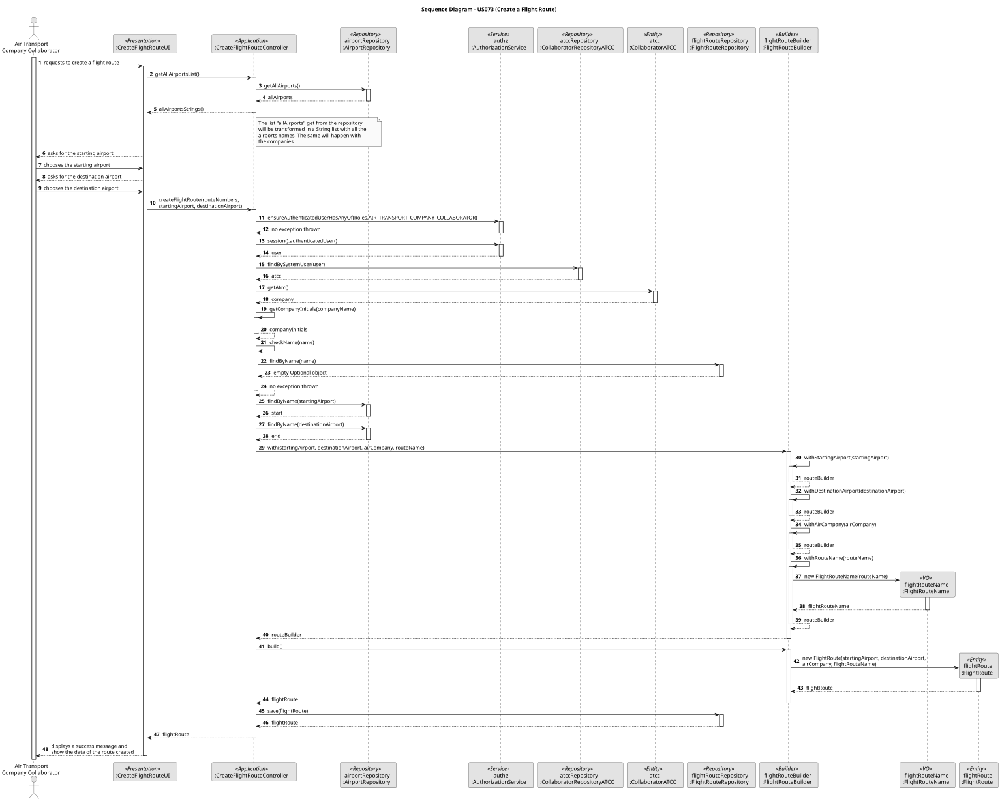

# US073 – Create a flight route

## 1. Context

In the context of an air transport company collaborator, one of its main tasks is to create flight routes for their companies. Air transport companies possess their own flight routes that are defined by a path between two airports (start and end).

### 1.1 List of issues

#### Analysis:

1. **What defines a flight route in the system?**
- A flight route is defined by a connection between two airports (start and end), and it belongs to a specific air transport company.

2. **What are the constraints on the flight route name?**
- The flight route name must be unique in the system and must be necessarily composed by the two company letter initials and then up to four numbers.

3. **What attributes are needed to create a flight route?**
- The name of the flight route, the start and end airports, and the associated air transport company.

#### Design:
 
- Design of a UI class `CreateFlightRouteUI` to provide a user interface for managing flight routes creation.
- Design of a Controller class `CreateFlightRouteController` to handle the business logic for managing flight route creation classes.
- Design of a Builder class `FlightRouteBuilder` to facilitate its creation while ensuring that all necessary attributes are provided and valid.
- Design of a Repository class `FlightRouteRepository` and its implementations: `JpaFlightRouteRepository` and `InMemoryFlightRouteRepository` to manage the persistence of flight routes.
- Design of a Domain entity `FlightRoute`.
- Design of the Value Object `FlightRouteName` that represents the name of a flight route.

#### Implement:

- UI: `CreateFlightRouteUI`.
- Controller: `CreateFlightRouteController`.
- Builder: `FlightRouteBuilder`.
- Repository: `FlightRouteRepository`, `JpaFlightRouteRepository` and `InMemoryFlightRouteRepository`.
- Domain: `FlightRoute` and `FlightRouteName`.

#### Test:

- Unit tests for the Domain and Controller classes.
- Manual tests for the use case functioning.

## 2. Requirements

**US073** – As an Air Transport Company Collaborator, I want to add a flight route for my company. A route is between two airports (start and end) and has a name with two letters (my company’s initials) and up to four numbers (e.g., TP123). The route’s name must be unique.

**Acceptance Criteria:**

- A flight route is defined by a path between two airports (start and end).
- The route name is unique in the system.
- The flight route name is composed of two letters (company initials) and up to four numbers.
- Air transport companies have their own routes.

**Dependencies/References:**

US073 depends on US060, for the registration of the air transport company, and US070, for the registration of the airports. Beyond that, US073 depends also on US030, for the authentication and authorization of the Company Collaborators users.

## 3. Analysis

The key requirements to take in consideration for the creation of a flight route are:

1. **Key Uniqueness:** The flight route name must be unique in the system, and this invariant will be validated by the application. The route name is the identifier of the flight route.
2. **Name Structure:** The flight route name must be composed of: first, two letters (company initials) and up to four numbers. The UI will guarantee this structure.
3. **Association with Airports:** The flight route must be associated with two airports (start and end), with that association being the definition of a route.
4. **Company Association:** The flight route must be associated with an air transport company, since each company has its own routes.
5. **Authorization:** Flight routes can only be created by Air Transport Company Collaborators.
6. **Persistence:** Flight routes must be persisted in the database/repository.

## 4. Design

The use case design divides the application concerns into four layers:

- **Presentation Layer**: `CreateFlightRouteUI` handles user interaction, gathering starting and ending airports, the air transport company, and the flight route name. It's important to note that, when the ATCC chooses a company from the companies dropdown list, the UI automatically composes part of the route name with the company initials. The ATCC will only input the final one to four numbers to complete the route name.
- **Application Layer**: `CreateFlightRouteController` coordinates the use case.
- **Domain Layer**:
    - `FlightRoute` is the Aggregate Root.
    - `FlightRouteName` is the Value Object, encapsulating domain logic and validation.
    - `FlightRouteBuilder` simplifies the creation of the `FlightRoute` aggregate.
- **Infrastructure Layer**:
    - `FlightRouteRepository` (interface) and its implementations (`JpaFlightRouteRepository`, `InMemoryFlightRouteRepository`) handle persistence.

### 4.1. Realization

### 4.2. Acceptance Tests

**Unit Tests**
- **Action:** Test the domain and controller classes involved in the flight route creation process.
- **Expected Result:** All classes should pass their respective unit tests.

**Manual Test 1: Create a Flight Route**
- **Action:** Navigate to the flight route creation page in the ATCC application and create a new one.
- **Expected Result:** Success message should be displayed and the new flight route should be persisted in the database.

**Manual Test 2: Same Flight Route Name**
- **Action:** Create a new flight route with the same name as an existing one.
- **Expected Result:** An error message should be displayed indicating that the flight route name is already in use.

## 5. Implementation

### Key Classes

- `CreateFlightRouteUI`: user interface for creating flight routes in case of a manual registration.
- `CreateFlightRouteController`: controller for handling the application flow for creating flight routes.
- `FlightRouteBuilder`: builder class for creating flight route domain objects.
- `FlightRouteRepository`: interface for managing the persistence of flight routes.
- `JpaFlightRouteRepository`: JPA implementation of the flight route repository.
- `InMemoryFlightRouteRepository`: in-memory implementation of the flight route repository.
- `FlightRoute`: domain entity representing a flight route.
- `FlightRouteName`: value object representing the name of a flight route.

## 6. Integration/Demonstration

To demonstrate the functionality:

1. Build the project (`build.bat` or `build.sh`).
2. (Optional) Run the bootstrap process for initial data bootstrapping (usually via `run-bootstrap.bat` or `run-bootstrap.sh`).
3. Run the ATCC application (`run-atcc.bat` or `run-atcc.sh`).
4. Log in with ATCC operator credentials (or create a new one) and navigate to the flight route creation page.
5. Use the UI to create a new flight route.
6. Input the required data.
7. Read the success message or check the new flight route's existence in the database.

## 7. Observations

None.
