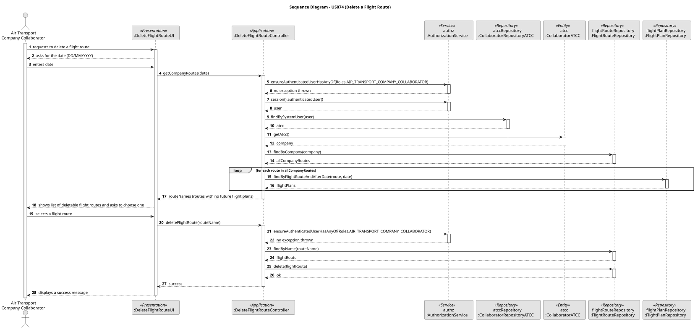

# US074 – Delete a flight route

## 1. Context

In the context of the main ATCC occupations concerning flight routes, it's necessary to provide a way for the Company Collaborators to delete flight routes once they are no longer in use or, maybe from a business perspective, no longer needed.

### 1.1 List of issues

#### Analysis:

1. **What are the constraints for the deletion of flight routes?**
- A flight route can be deleted from a given date onwards, but only if there are no planned flights after that date. Beyond that, the ATCC can only delete flight routes from its own company.

#### Design:

- Design of the UI class `DeleteFlightRouteUI` to provide a user interface for managing flight routes deletion.
- Design of the Controller class `DeleteFlightRouteController` to handle the business logic for managing flight route deletion classes.

#### Implement:

- UI: `DeleteFlightRouteUI`
- Controller: `DeleteFlightRouteController`

#### Test:

- Unit tests for the Domain and Controller classes.
- Manual tests for the use case functioning.

## 2. Requirements

**US074** – As an Air Transport Company Collaborator, I want to deactivate a flight route from a given date onwards. No more flights can be created on a deleted flight route. But a route cannot be deleted if there are planned flights after that date.

**Acceptance Criteria:**

- The ATCC can only delete a flight route if it is not planned for any flight after the deletion date.
- After the deletion, the flight route is no longer available for use.

**Dependencies/References:**

US074 depends on US073, that requests the creation of a flight route. Beyond that, US073 depends also on US030, for the authentication and authorization of the Company Collaborators users.

## 3. Analysis

The key requirements to take in consideration for the deletion of a flight route are:

1. **Accordance with the ATCC company:** Belonging to a certain air transport company, the ATCC can only delete flight routes from its own company.
2. **No planned flights after the deletion date:** No flights can be created based on a deleted flight route. Beyond that, it's not possible to delete a flight route if there are already planned flights after the deletion date.

## 4. Design

The use case design divides the application concerns into only two layers:

- **Presentation Layer**: `DeleteFlightRouteUI` handles user interaction, gathering the date from which the flight route should be deleted.
- **Application Layer**: `CreateFlightRouteController` coordinates the use case.

### 4.1. Realization

### 4.2. Acceptance Tests

**Unit Tests**
- **Action:** Test the domain and controller classes involved in the flight route deletion process.
- **Expected Result:** All classes should pass their respective unit tests.
  
**Manual Test 1: Delete a selected Flight Route**
- **Action:** Navigate to the flight route page in the ATCC application and select one to delete.
- **Expected Result:** Success message should be displayed.

## 5. Implementation

### Key Classes

- `DeleteFlightRouteUI`: user interface for deleting flight routes manually.
- `DeleteFlightRouteController`: controller for handling the application flow for deleting flight routes.

## 6. Integration/Demonstration

To demonstrate the functionality:

1. Build the project (`build.bat` or `build.sh`).
2. (Optional) Run the bootstrap process for initial data bootstrapping (usually via `run-bootstrap.bat` or `run-bootstrap.sh`).
3. Run the Collaborators application (`run-collaborators.bat`).
4. Log in with ATCC operator credentials (or create a new one) and navigate to the flight route page.
5. Use the UI to delete a specific flight route.
6. Read the success message.

## 7. Observations

None.
