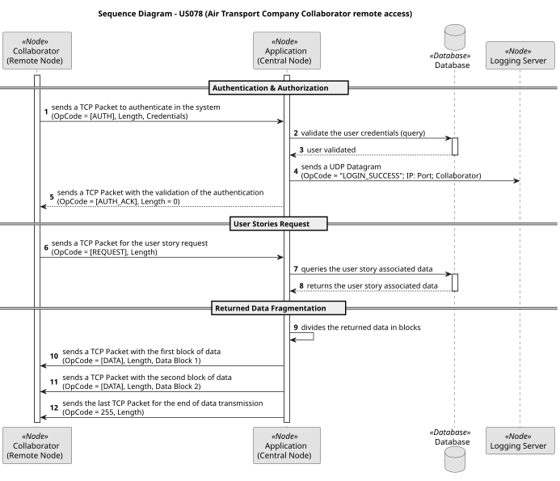

# US078 – Air Transport Company Collaborator remote access

## User Story Description

> As an Air Transport Company Collaborator, I want to remotely access the system using the Air Transport Company App.

**Acceptance Criteria:**
- A specific TCP-based network client application is required to communicate with the server application embedded in the system.
- The client application interaction with the system must be limited to the TCP connection; remarkably, any direct interaction with the database is unacceptable.
- All the Air Transport Company Collaborator user stories must be remotely available by using this client application.
- Authentication and authorization must be enforced.

---

## Requirements

### Functional Requirements

1. **Remote Authentication & Authorization of the ATCCs**: The ATCC must be able to insert its credentials and send an authentication request to the application server. The application server must validate these credentials and authorize the session based on the ATCC profile permissions.
2. **User Stories Remote Access**: The application server must provide to the client remote node an application interface that gives the ATCC access to all its User Stories.

### Non-Functional Requirements

1. **Database Isolation**: The database cannot be accessed directly by the client node/ATCC. All persistence requests must be done through the application server.
2. **TCP-based Communication Protocol**: The communication protocol between the Client and Application nodes must be mandatory TCP-based.

---

## Analysis

1. **How should the system provide the authentication and authorization for the ATCCs?**
   - The client remote node will establish a persistent connection with the application server using a TCP Client Socket. Once this connection is established, the client remote node will send a TCP Packet to the application server through the socket's output stream with both the login request and the ATCC credentials. The application server then will send those credentials to the database and check if they exist and are valid. 
   In a successful scenario, the application server will send a TCP Packet back to the client node, giving it authentication and authorization to the system, along with the authentication and authorization success message.

2. **How should the system provide the remote access to the ATCC user stories?**
    - Once the client node has access to the system, it will receive an application interface that allows it to send a TCP Packet to the application server with a specific request, related to the user story it wants to access.

3. **How should the system ensure that the database is not accessed directly by the client node/ATCC?**
   - The client node is decoupled from the persistence layer by design. The client application only possesses the network configuration (IP address and port) required to open a TCP Socket to the application server. This way, the client node will only be able to send TCP Packets to the application server, and the application server is the only component that can access the database directly. 

4. **How should the system ensure that the communication protocol between the client and application nodes is only TCP-based?**
   - The system will be designed to only accept TCP Packets from the client node, and any other type of communication will be rejected. The application server will be configured to listen for TCP connections on a specific port, and any incoming connection that does not use TCP will be denied access.

---

## Design Decisions

1. **Logging Server**
   - The Logging Server (implemented by the team-member responsible by US090) will be responsible for logging all the ATCC authentication and authorization trials events to the system. The application server will be responsible for sending a UDP Datagram to the Logging Server immediately after the successful or failed authentication. It will promote more coherence, consistency, traceability and security in the system.

2. **Returned Data Fragmentation Capability** 
   - Once the Application server receives the ATCC requested data from the database, if the data volume is too big, it must be able to split this data block in multiple fragments and send them sequentially back to the client remote node. It will be crucial for the ATCC data request user stories, since the data volume might exceed the application's pre-allocated memory buffers.

3. **Simultaneous Access Supportability**
   - The Application server must be able to support simultaneous accesses from multiple ATCCs at the same time by the use of a multithreaded environment, without those accesses interfering with each other. This decision comes from the idea to promote more flexibility and versatility to the system. 

4. **Custom Application Layer Protocol**
   - To meet the database isolation requirements and allow remote access to User Stories via pure TCP Sockets, it was necessary to design a custom Application Layer Protocol, based on fixed headers. The choice of a binary protocol based on fixed headers (Framing) was made to minimize network overhead and simplify parsing on both the server and client nodes.
   
   - The composition of the TCP Packet transferred via TCP Sockets between the client and application nodes is as follows:
     - **OpCode**: one byte size field that represents the intent of the packet. 
     - **Length**: four bytes size field that represents the length of the packet payload.
     - **Payload**: variable size field that represents the packet data. The OpCode field determines the content of this field. For example, if the OpCode represents an authentication request, the payload will contain the ATCC credentials (username and password). If the OpCode represents a user story data request, the payload will contain the specific parameters required for that user story. When the Length field is zero, this field is omitted.

---

## Realization

Under a high-level view, the system is architected as follows:

---

## Implementation

The remote access infrastructure is implemented in the `eapli.alsafe.remoteaccess` package (`alsafe.core`), with the server entry point in the `alsafe.app.remoteaccess` module.

### Key Components:

**Protocol layer (shared between client and server):**

- `Packet` : immutable record that materializes the custom Application Layer Protocol, containing the `opCode` (one byte), `length` (four bytes) and `payload` (variable size) fields. It validates that the length is non-negative and defensively copies the payload.
- `Utils` : utility class responsible for the protocol framing. `sendPacket()` serializes a `Packet` into the socket output stream (opCode byte, followed by the length as four bytes in big-endian order, followed by the payload), and `receivePacket()` performs the inverse operation, reading from the input stream in a loop until all the expected bytes are received.
- `TCPClient` : client-side wrapper around the TCP Socket, used by the Air Transport Company App. It only knows the server IP address and port, and exposes `connect()`, `sendPacket()`, `receivePacket()` and `disconnect()` operations — reinforcing the database isolation requirement, since the client node has no access to the persistence layer.

**Server layer:**

- `RemoteServer` : application server entry point. It configures the `AuthzRegistry` (authentication/authorization framework), opens a `ServerSocket` on the TCP port and enters an infinite acceptance loop. For each incoming client connection, it spawns a **new thread** running a `ClientHandler`, fulfilling the Simultaneous Access Supportability design decision.
- `ClientHandler` : `Runnable` responsible for the lifecycle of a single client connection. It loops receiving `Packet`s from the socket input stream and processes them as follows:
  - `opCode 1` (authentication request): the packet is dispatched to the `AuthenticationRequestHandler` and, immediately after, a **UDP Datagram** with the authentication trial result (success or failure) is sent to the Logging Server, fulfilling the Logging Server design decision;
  - `opCode 0` (disconnection request): the server replies with an acknowledgment packet, and the loop ends, closing the socket safely;
  - any other `opCode`: the packet is forwarded to the `RemoteAccessDispatcher` and the resulting response packet is sent back to the client.
- `RemoteAccessDispatcher` : routes each incoming request to the proper handler, based on its `opCode`, using an immutable `Map<Byte, RemoteAccessRequestHandler>`. If no handler is registered for the received `opCode`, it returns an error packet (`opCode 99`) without breaking the connection.
- `RemoteAccessHandlerRegistry` : central registry that binds each protocol `opCode` to its concrete request handler. This is the **single point of extension** of the protocol: making a new user story remotely available only requires implementing a new handler and registering it here with a free `opCode`.

### Request Handler Pattern:

All the ATCC functionalities are exposed remotely through classes implementing the `RemoteAccessRequestHandler` interface.

Each concrete request handler follows the same pattern:

1. **Parse** the request payload — a string with the user story parameters separated by `;` (e.g., `model;ID;country;economy;business;firstClass;crewCount` for the aircraft registration), validating its format;
2. **Delegate** to the same use case controller used by the local backoffice UI (e.g., `AddAircraftController`, `ListFleetController`), so no business logic is duplicated in the network layer and all persistence is done server-side;
3. **Build** the response `Packet`: `opCode 100` with the result in the payload on success, or `opCode 101` with an error message on failure.

The `AuthenticationRequestHandler` follows this same pattern for the authentication and authorization requirement: it parses the `email;password;[roles]` payload and delegates to the eapli framework `AuthenticationService`, which validates the credentials and the ATCC role against the database.

### ATCC Protocol OpCodes:

| OpCode  |                Handler                |                Remote Functionality                 |
|:-------:|:-------------------------------------:|:---------------------------------------------------:|
|    0    |    — (handled by `ClientHandler`)     |            Client disconnection request             |
|    1    |    `AuthenticationRequestHandler`     |           Authentication & authorization            |
|    2    |  `ListAircraftModelsRequestHandler`   |                List aircraft models                 |
|    3    |      `AddAircraftRequestHandler`      |            Add an aircraft to the fleet             |
|    4    |  `ListActiveAircraftRequestHandler`   |                List active aircraft                 |
|    5    | `DecommissionAircraftRequestHandler`  |              Decommission an aircraft               |
|    6    |     `ListAircraftRequestHandler`      | List/search the fleet (by model, maker or capacity) |
|    7    |      `GetAirportsRequestHandler`      |               Get available airports                |
|    8    |   `CreateFlightRouteRequestHandler`   |                Create a flight route                |
|    9    |   `DeleteFlightRouteRequestHandler`   |                Delete a flight route                |
|   10    |       `AddPilotRequestHandler`        |                     Add a pilot                     |
|   11    |    `ListPilotRosterRequestHandler`    |                List the pilot roster                |
|   12    |      `RemovePilotRequestHandler`      |                   Remove a pilot                    |

Response packets use opCodes `100` (success), `101` (failure/invalid request) and `99` (unknown operation code). The registry also holds handlers for the Weather Person remote functionalities (opCodes 13–16), which are out of the scope of this US.

### Network Configuration:

It was defined:

**TCP Port: 2223**
- On the other hand, this port is used by the `RemoteServer` to listen for client connections. It uses the TCP protocol, and it's used by the client to send and receive TCP Packets with the authentication and authorization requests, as well as the user story data requests. 

---

## Acceptance Tests

**Manual Test 1: Remote Authentication & Authorization of an ATCC**
- **Action:** Insert the ATCC credentials and send the authentication and authorization request to the application server.
- **Expected Result:** Successful message indicating a successful authentication and authorization in the system.

**Manual Test 2: Remote Authentication & Authorization trial of an ATCC with invalid credentials**
- **Action:** Attempt to log in the system sending invalid credentials to the application server.
- **Expected Result:** Error message indicating that the credentials are invalid, according to the database.

**Manual Test 3: Access a specific ATCC User Story remotely**
- **Action:** Attempt to execute a user story that requires a database insertion or update, input the required parameters and send the request to the application server.
- **Expected Result:** Successful message indicating that the user story was executed successfully and the database is now updated with the new data.

**Manual Test 4: Access a specific ATCC User Story remotely that requires a big data listing**
- **Action:** Attempt to execute a user story that requires a large data listing, input the required parameters and send the request to the application server.
- **Expected Result:** Successful message indicating that the user story was executed successfully and the large data gets listed sequentially.

---

## Observations

None.
